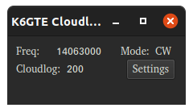
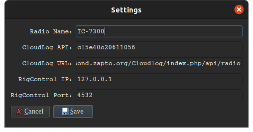

# CloudLogPyCAT

      

Python client to query the [flrig's](http://w1hkj.com/files/flrig/) XmlRPC interface and report radio frequency/mode to CloudLog

Written in Python3, using QT5. Either run from source, or if your running Linux, download the binary [here](https://github.com/mbridak/CloudLogPyCAT/releases/download/21.5.14/CloudLogPyCAT)

When run for the first time click the settings button and edit the needed bits.

Then be sure to select your radio under the station tab while on the QSO screen for the updated band/mode data to show.

I've updated the desktop icon to be 3d animated. When you try and click on it to launch the program, the cat will bat the mouse away with it's paws.

That last part was BS. Just checking to see if you were paying attention.

